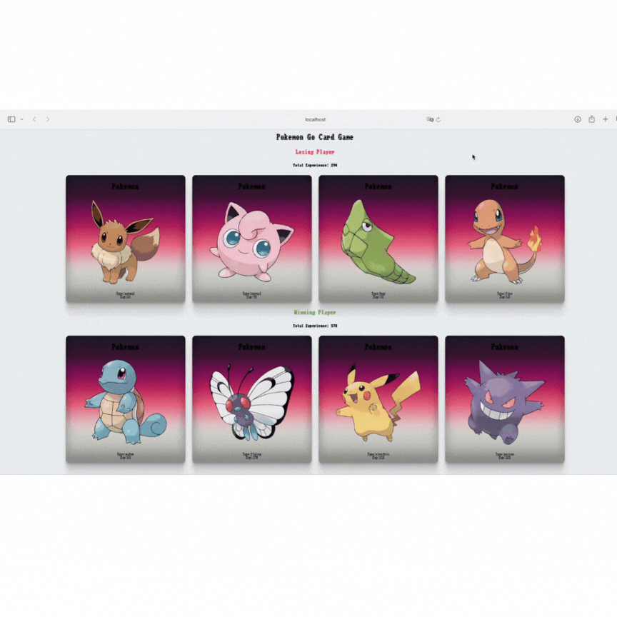

# POKEDOX GAME ABOUT
In this game played on Pokemon cards drawn via API, 8 different cards are selected on groupings of four as the page refreshes. The group with the most experience among these groups is determined as the winning group and the group with less experience is determined as the losing group. Good luck and good games

# REFERENCES USED
- https://webgradients.com
- https://getcssscan.com/css-box-shadow-examples

# PROJECT GIF:
# PokeCardGame
